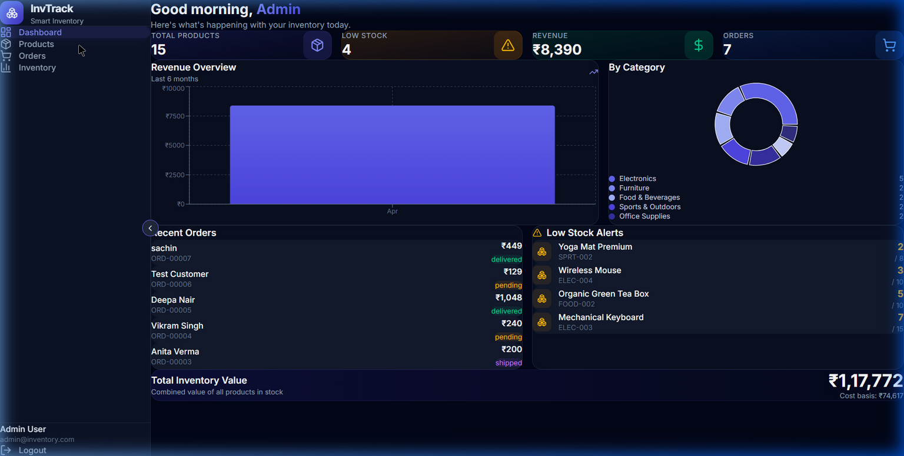
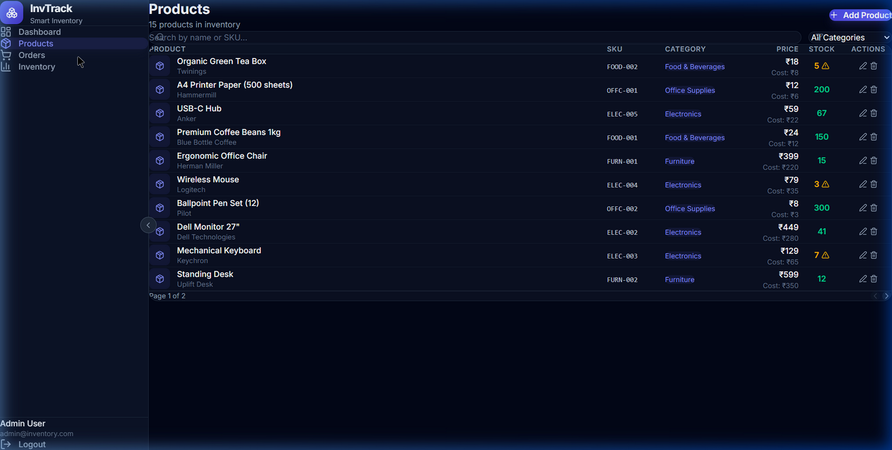
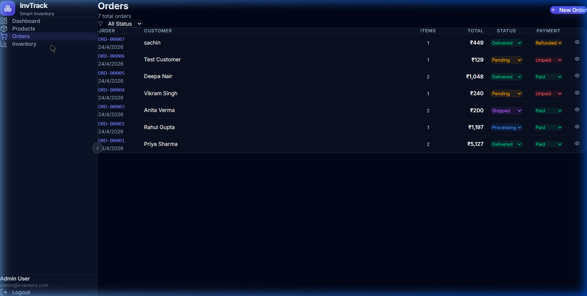

# 🚀 Smart Inventory Management System (InvTrack)

A full-stack MERN application for small businesses to manage inventory, track stock, and monitor sales efficiently.


---

## 📸 Screenshots

### Dashboard


### Products


### Orders


---

## 📁 Project Structure

```
smart-inventory/
├── client/                 # React Frontend (Vite + Tailwind CSS)
│   ├── src/
│   │   ├── api/           # Axios instance with interceptors
│   │   ├── components/    # Reusable UI components
│   │   ├── context/       # React Context (Auth)
│   │   ├── pages/         # Page components
│   │   └── index.css      # Global styles + Tailwind
│   └── vite.config.js     # Vite config with API proxy
│
├── server/                 # Node.js Backend (Express)
│   ├── config/            # Database connection
│   ├── controllers/       # Business logic (MVC)
│   ├── middleware/         # Auth & error handling
│   ├── models/            # Mongoose schemas
│   ├── routes/            # API route definitions
│   ├── utils/             # Seeder script
│   └── server.js          # Entry point
│
└── package.json           # Root scripts
```

---

## ⚡ Quick Setup

### Prerequisites
- **Node.js** v18+
- **MongoDB** running locally (or MongoDB Atlas URI)

### 1. Install Dependencies

```bash
# Install root dependencies
npm install

# Install server dependencies
cd server && npm install && cd ..

# Install client dependencies
cd client && npm install && cd ..
```

### 2. Configure Environment

Edit `server/.env`:
```env
PORT=5000
MONGODB_URI=mongodb://localhost:27017/smart-inventory
JWT_SECRET=your_secret_key_here
JWT_EXPIRE=7d
NODE_ENV=development
```

### 3. Seed Demo Data

```bash
npm run seed
```
This creates:
- **Admin user**: `admin@inventory.com` / `admin123`
- **15 sample products** across categories
- **5 sample orders** with different statuses

### 4. Run the App

```bash
npm run dev
```
- Frontend: http://localhost:5173
- Backend: http://localhost:5000

---

## 🔥 Features

### 🔐 Authentication
- JWT-based registration & login
- Protected routes with token verification
- Role-based access control (admin, manager, staff)

### 📊 Dashboard
- Real-time business metrics (products, revenue, orders)
- Revenue trend chart (last 6 months)
- Category distribution pie chart
- Low stock alerts with threshold indicators
- Recent orders list

### 📦 Product Management
- Full CRUD operations
- Search by name/SKU
- Category filtering
- Pagination
- Low stock warnings (pulse animation)
- Cost price & profit margin tracking

### 🛒 Order Management
- Create orders with dynamic item selection
- Automatic stock deduction on order creation
- Stock restoration on order cancellation
- Order status tracking (pending → delivered)
- Payment status management
- Order detail view

### 📈 Inventory Tracking
- Stock level overview with progress bars
- Category breakdown chart
- Low stock vs well-stocked comparison
- Category summary table with totals

---

## 🧠 API Endpoints

| Method | Endpoint | Description |
|--------|----------|-------------|
| POST | `/api/auth/register` | Register new user |
| POST | `/api/auth/login` | Login user |
| GET | `/api/auth/me` | Get current user |
| GET | `/api/products` | List products (paginated) |
| POST | `/api/products` | Create product |
| PUT | `/api/products/:id` | Update product |
| DELETE | `/api/products/:id` | Delete product |
| GET | `/api/products/categories/stats` | Category statistics |
| GET | `/api/orders` | List orders |
| POST | `/api/orders` | Create order |
| PUT | `/api/orders/:id` | Update order status |
| GET | `/api/dashboard/stats` | Dashboard analytics |

---

## 🎯 Interview Talking Points

### Why This Project?
Inventory management is a **universal business need**. Every retail store, warehouse, e-commerce platform, and manufacturing unit uses some form of inventory tracking. This project solves a real-world problem that interviewers can immediately understand and relate to.

### Where It's Used in Real Life
- **Retail stores** (Shopify, Square) — track products and sales
- **Warehouses** (SAP, Oracle) — monitor stock levels and reordering
- **Restaurants** — ingredient tracking and supplier management
- **E-commerce** (Amazon Seller Central) — inventory across fulfillment centers
- **Hospitals** — medical supply and equipment tracking

### Why MERN Stack?
1. **JavaScript everywhere** — One language for frontend, backend, and database queries
2. **MongoDB** — Flexible schema perfect for varied product data; JSON-native
3. **Express.js** — Lightweight, middleware-based; ideal for REST APIs
4. **React** — Component-based UI; efficient re-renders with virtual DOM
5. **Node.js** — Event-driven, non-blocking I/O; handles concurrent requests efficiently

### Scalability Path
1. **Caching** — Add Redis for dashboard stats and product queries
2. **Search** — Integrate Elasticsearch for full-text product search
3. **Real-time** — Add Socket.io for live stock updates across clients
4. **Microservices** — Split into separate services (auth, products, orders)
5. **File uploads** — Add product images via Cloudinary/S3
6. **Reports** — PDF/CSV export for sales reports
7. **Multi-warehouse** — Support multiple stock locations
8. **Barcode scanning** — Mobile-friendly barcode integration

### Architecture Decisions Worth Discussing
- **JWT in localStorage** vs httpOnly cookies (trade-offs)
- **Mongoose virtuals** for computed fields (isLowStock, profitMargin)
- **MongoDB aggregation pipeline** for analytics
- **Axios interceptors** for automatic token attachment
- **React Context** vs Redux (why Context is sufficient here)
- **Vite proxy** eliminates CORS issues in development

---

## 🛠️ Tech Stack Details

| Layer | Technology | Purpose |
|-------|-----------|---------|
| Frontend | React 19 + Vite | Fast SPA with HMR |
| Styling | Tailwind CSS v4 | Utility-first responsive design |
| Charts | Recharts | Data visualization |
| Icons | Lucide React | Consistent iconography |
| HTTP | Axios | API calls with interceptors |
| Toasts | React Hot Toast | User feedback notifications |
| Backend | Express.js | REST API server |
| Database | MongoDB + Mongoose | Document-oriented persistence |
| Auth | JWT + bcryptjs | Secure authentication |
| Logging | Morgan | HTTP request logging |

---

## 📜 License

MIT — Use freely for learning and interviews.
